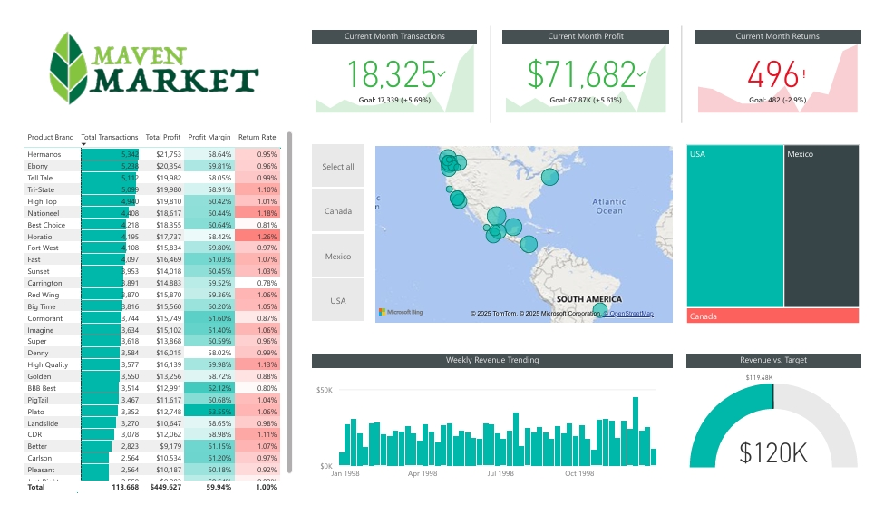
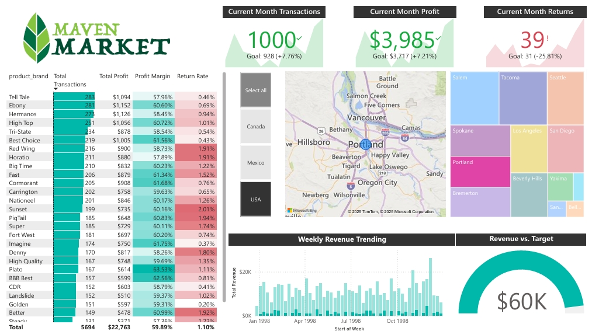
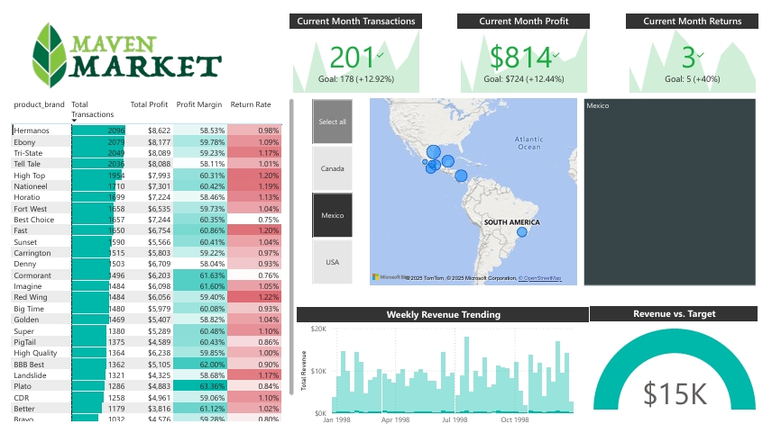
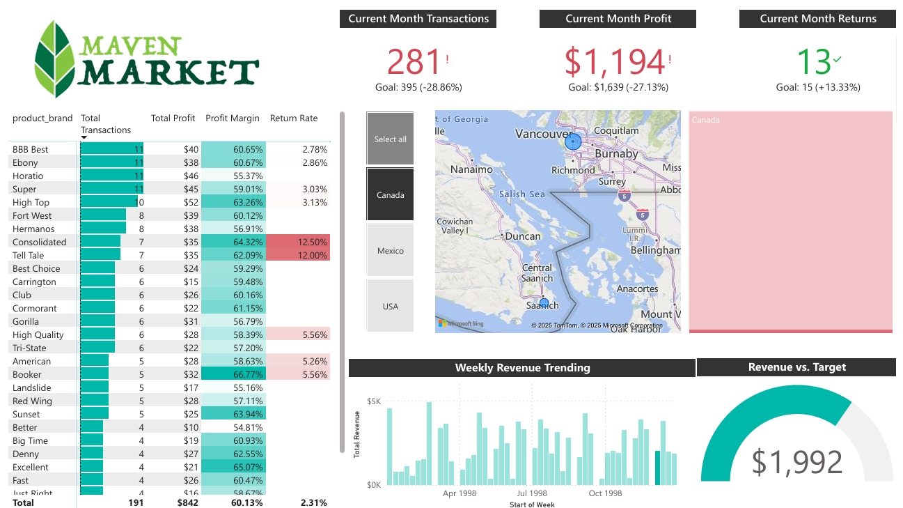

# MavenMarket

A Microsoft Power BI business intelligence dashboard for Maven Market, a multi-national grocery chain with locations in Canada, Mexico and the United States.

The customer base is spread across 3 countries: Canada, Mexico and the United States. Transactions and Returns data is available for the period between 01/01/1997 and 30/12/1998. Customer profiles include date of birth, annual income, education level, number of children, occupation and homeowner status, marital status. 

## Features

- Track key performance indicators (KPIs) related to transactions, profit, and returns and compare it with last month data.
- Compare performance across different regions.
- Analyse product-level trends.
- Analyze the transactions trending over time and check whether it met the target.

## Project Highlights

This project involved the following tasks:

- connecting and transforming the raw data 
- building a relational data model
- creating calculated columns and measures using **DAX**
- Created a rolling calendar using **PowerQuery M code**
- building an interactive dashboard

## Dashboard Elements

#### Executive Summary View

- high-level KPIs for transactions, Profit and retur and returns.
- Maps and Tree Maps to check total transactions per country and drill down to country, state and city.
- Weekly revenue trends are analyzed using column charts.
- Check whether revenue has met the target using gauge chart.

#### Notes View

- Performance results.

#### Custom UI Elements

- filter pane for filtering by year and geography
- bookmarks to capture insights.

### Insights

- Approximately $71.7 million in profit was generated in 1998 with most revenue made in 6/12/1998 which is $44,860. Total revenue $1.199M has exceeded the target revenue which is 1.192M.

- Portland has hit 1000 sales in December 1998.

- Top Product with most Revenue is Hermanos which has  made most transactions from Mexico

- Canada made the least profit in july 1998

